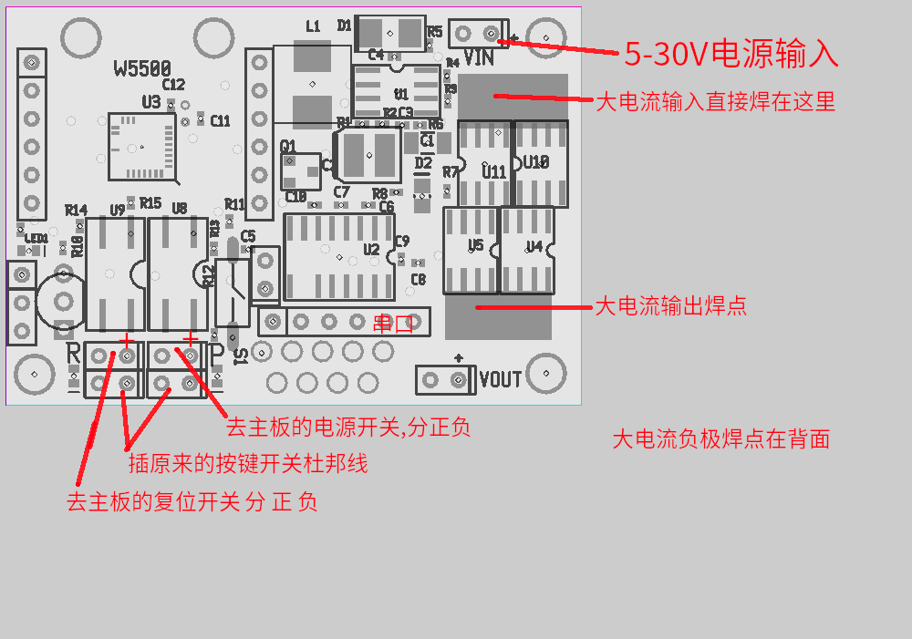
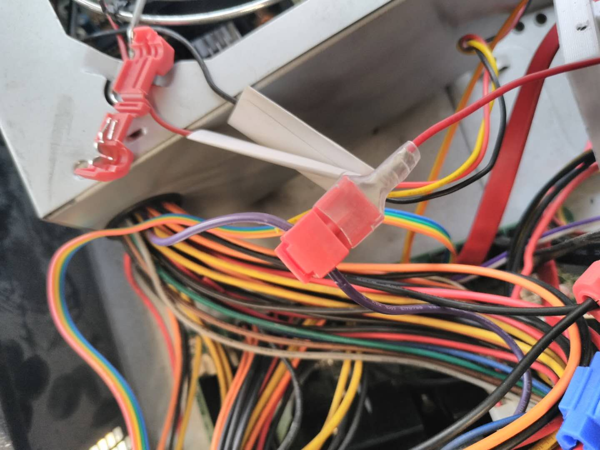
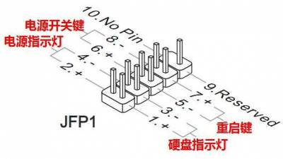
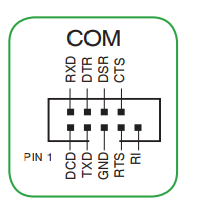
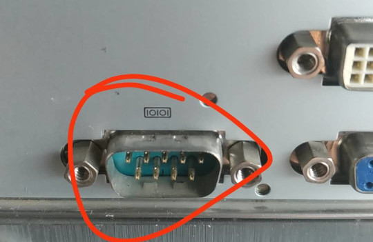
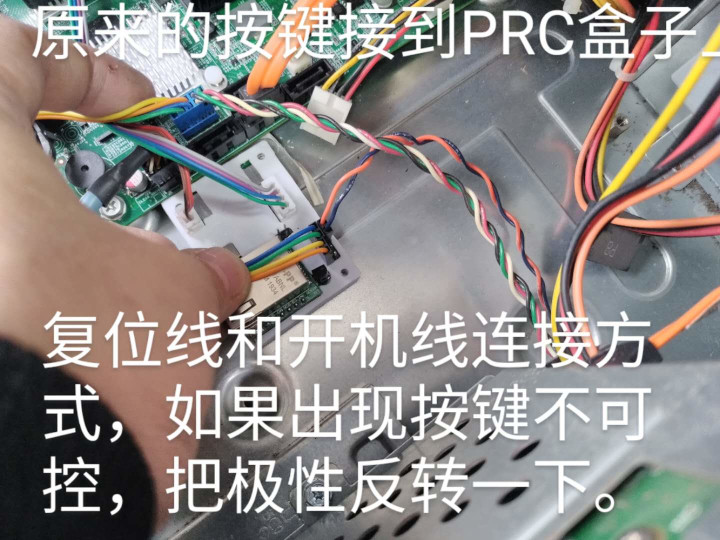

# PROC-V1 Remote Controller Hardware User Manual

> **English translation of** https://bjlx.org.cn/node/914
> Original title: **PROC-V1 远程控制器硬件用户手册**
> Author: 刘世伟 (Liu Shiwei) · Published Saturday, 2020-04-25 09:56
> Site: 北京龙芯＆debian用户俱乐部 (Beijing Loongson & Debian User Club)
>
> Translated 2026-07-25. Images are local copies of the originals from
> `bjlx.org.cn/system/files/images/`. Editorial notes added by the translator
> are marked **[Note]** and are not part of the original.

**Companion page:** [Software user manual](https://github.com/osuosl/proc/blob/main/doc/node-926-software-manual.md)
(original: https://bjlx.org.cn/node/926)

---

PROC (PC remote operation controller) can control a PC's reset button and power
button over the network, for remote power on/off and remote restart. It can also
enter the serial port and interact with the BIOS, the bootloader and the Linux
console, to complete OS installation, network configuration, fault recovery,
remote maintenance and so on.

**PROC-V1** is the RJ45-interface PC remote operation controller. **PROC-V2** is
the WiFi-interface PC remote controller. The installation method for V1 follows.

## Installation

### Pin descriptions

*(The photo is of an early revision; the newer PROC V1.1 no longer distinguishes
switch polarity.)*



Annotations in that image, translated:

| Chinese | English |
|---|---|
| 5-30V电源输入 | 5–30 V power input |
| 大电流输入直接焊在这里 | Solder the high-current input directly here |
| 大电流输出焊点 | High-current output solder pad |
| 大电流负极焊点在背面 | The high-current negative pad is on the back of the board |
| 去主板的电源开关，分正负 | To the motherboard power switch — polarity matters |
| 去主板的复位开关 分 正 负 | To the motherboard reset switch — polarity matters |
| 插原来的按键开关杜邦线 | Plug in the original button-switch Dupont lead |
| 串口 | Serial port |


**[Note]** The V1.1 board silkscreen reads, from the serial pad group:
`RTS · TX_232 · RX_232 · GND · RX_TTL · TX_TTL`, and on the opposite edge
`PWM · 3.3V · GND · 5-28V`, a W5500 SPI breakout (`MOSI · CLK · CS · MISO ·
INT · RESET`), an `Update` header, and `POWER SWITCH` / `RESET SWITCH` headers.
See [../AGENTS.md](../AGENTS.md) §6 for the full connector reference.

### Power

Take power from the power supply's **purple wire (standby 5 V)** and a **black
wire (ground)**. The purple wire can supply 5 V while the computer is switched
off.



### Front-panel switches

The motherboard's on-board switch header generally looks like this. PROC provides
two sets of switch leads: an ordinary 2-pin Dupont lead, and a 2×5 shell — you
can pull the hard-disk-LED and power-LED wires out of their Dupont shells, fit
them into the 2×5 shell, and plug the whole assembly onto the motherboard.



That diagram's labels, translated (this is the common MSI-style **JFP1** header):

| Chinese | English | Pins |
|---|---|---|
| 电源开关键 | Power switch button | 6, 8 |
| 电源指示灯 | Power LED | 2, 4 |
| 重启键 | Reset button | 5, 7 |
| 硬盘指示灯 | Hard-disk activity LED | 1, 3 |
| 9. Reserved | Reserved | 9 |
| 10. No Pin | Keyed — no pin | 10 |



That is the internal COM header pinout — bottom row from pin 1: `DCD`, `TXD`,
`GND`, `RTS`, `RI`; top row: `RXD`, `DTR`, `DSR`, `CTS`. See also
[node 953](node-953-motherboard-com-header.md).

At this point installation is complete. For a router, or a mini PC with a
separate 12 V input supply, you have to solder your own leads.

### Serial port

The serial port is **RS-232 level — do not connect it to a TTL-level serial
port.** Two sets of leads are provided: an external 9-pin serial cable, and an
internal 2×5 Dupont header for the motherboard. Any other cable form you make
yourself.



### Finished

Once everything is connected it looks like this:



Annotations in that image, translated:

> 原来的按键接到PRC盒子上 — *The original buttons connect to the PRC box.*
>
> 复位线和开机线连接方式，如果出现按键不可控，把极性反转一下。 — *How to wire
> the reset and power lines. If the buttons turn out to be uncontrollable,
> reverse the polarity.*

---

## Attachments on the original page

| File | Size | URL |
|---|---|---|
| `update.sh` | 222 bytes | https://bjlx.org.cn/system/files/update_0.sh |
| `ver 20210201-4b34ae9 firmware` | 84.18 KB | https://bjlx.org.cn/system/files/prc.ino__0.hex |

**[Note]** `update.sh` is a two-attempt `avrdude` wrapper:

```bash
#!/bin/bash
cd `dirname $0`
avrdude -v -patmega328p -carduino -P/dev/ttyUSB0 -b57600 -D -Uflash:w:prc.ino.hex:i
if [ $? != 0 ] ; then
avrdude -v -patmega328pb -carduino -P/dev/ttyUSB0 -b57600 -D -Uflash:w:prc.ino.hex:i
fi
```

**[Note]** The linked `.hex` reports itself as `PROC-V1-20210201-4b34ae9`. That
commit does not exist in the public [`prc`](https://github.com/osuosl/prc) repository; the firmware
source is in [`proc`](https://github.com/osuosl/proc/blob/main/AGENTS.md). Current upstream `proc` HEAD builds
as `PROC-V1-20241103-a8f458f`, so this attachment is roughly four years behind.

## Linked image pages

- [node 953 — 主板上的串口杜邦座 / Motherboard serial Dupont header](node-953-motherboard-com-header.md)
- [node 954 — procv1.1 hardware](node-954-procv1.1-hardware.md)

## Original page navigation (not part of the article)

The site chrome links to: Debian (http://debian.org), flygoat's blog
(https://blog.flygoat.com/), USTC Linux User Association
(https://lug.ustc.edu.cn/wiki/), Loongson official site (http://www.loongson.cn/),
Loongson User Club (http://www.loongsonclub.cn), and the author's blog at
https://bjlx.org.cn/blog/1.

© 2007-2024 北京龙芯用户俱乐部 (Beijing Loongson User Club)
