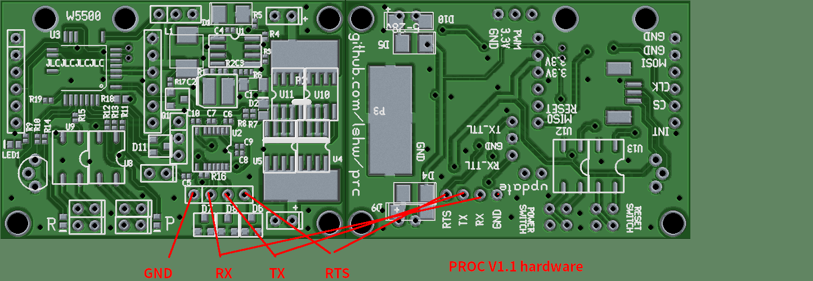

# procv1.1 hardware

> **English translation of** https://bjlx.org.cn/node/954
> Original title: **procv1.1 hardware** (already in English upstream)
> Author: 刘世伟 (Liu Shiwei) · Published Saturday, 2021-09-18 22:16
> Site: 北京龙芯＆debian用户俱乐部 (Beijing Loongson & Debian User Club)
>
> Translated 2026-07-25.

This is an **image-only page** on the original site — a photo gallery node with
a title and no body text. It is linked from the
[hardware manual](node-914-hardware-manual.md) as the reference board render for
revision **V1.1**.

---

The red annotations on the render label the four serial pads on the lower left:
**GND · RX · TX · RTS**. The caption reads `PROC V1.1 hardware`.

## What the silkscreen says

Reading the render, left board (top copper) and right board (bottom copper):

| Area | Silkscreen |
|---|---|
| Top left | `W5500`, `LED1`, and the `R` / `P` switch headers |
| Centre | `github.com/lshw/prc` |
| Right edge, top | `PWM`, `3.3V`, `GND`, `5-28V`, `+` |
| Right edge, middle | W5500 SPI breakout: `GND`, `GND`, `MOSI`, `CLK`, `CS`, `MISO`, `INT`, `RESET`, `3.3V`, `3.3V` |
| Right edge, lower | `Update`, `POWER SWITCH`, `RESET SWITCH` |
| Bottom edge | `RTS`, `TX`, `RX`, `GND`, `TX-TTL`, `RX-TTL`, `GND` |
| Bottom left | `VOUT`, `VIN`, `5-30V` |

## ⚠ V1.1 design files are not published

**This render is the only public artefact of revision V1.1.** The schematic and
PCB in this repository ([../control2.sch](../control2.sch),
[../control2.pcb](../control2.pcb)) are **revision 1.0** from December 2019.

Differences visible in the render that are absent from the published rev-1.0
files:

- a **PWM pad** — the firmware's `#define PWM 5` puts it on Arduino D5
  (PD5, package pin 9), which is unconnected in the rev-1.0 schematic
- a **W5500 SPI breakout header**
- separate **TTL-level serial pads** alongside the RS-232 ones
- per the [hardware manual](node-914-hardware-manual.md), V1.1 **no longer
  distinguishes switch polarity**, implying a different opto-isolator output
  arrangement than the EL357N single-transistor output on rev 1.0

If OSU OSL has V1.1 boards, the files in this repository do not fully describe
them. See [../AGENTS.md](../AGENTS.md) §8 issue H5.
